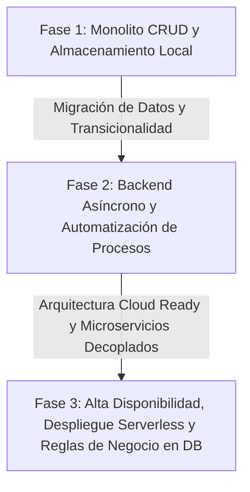
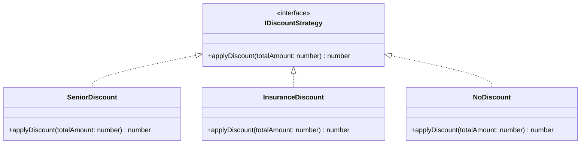

# Antigravity: Documentación Técnica y Funcional del Sistema de Gestión de Farmacia Integral

Este documento constituye la especificación de diseño, arquitectura, manual de operación e ingeniería de software para **Antigravity**, una plataforma robusta y escalable diseñada para la gestión farmacéutica, el control de inventario de medicamentos por lotes, la automatización del punto de venta (POS) y la orquestación de tareas en la nube.

---

## 1. Introducción y Evolución del Proyecto

### 1.1 El Nacimiento de "Antigravity"
La logística y gestión de una farmacia moderna implican retos críticos que van más allá de un simple punto de venta. La trazabilidad de medicamentos con fecha de caducidad inminente, el estricto cumplimiento regulatorio sobre fármacos controlados, las variaciones dinámicas de precios y la necesidad de mantener un flujo continuo en el inventario impulsaron la concepción de **Antigravity**.

El nombre *Antigravity* simboliza la superación de las cargas operativas pesadas ("gravedad") que hunden la eficiencia de las farmacias tradicionales, reemplazándolas con un flujo de trabajo ligero, rápido y automatizado. El objetivo principal fue diseñar una plataforma integral capaz de prevenir pérdidas financieras por merma (caducidad de productos), optimizar la cadena de suministro mediante compras inteligentes y agilizar la atención en el punto de venta.

### 1.2 Fases del Desarrollo
El sistema evolucionó a través de tres fases de madurez arquitectónica:



1. **Fase 1: Monolito CRUD (Prueba de Concepto - PoC)**
   - **Enfoque**: Interfaz simple en desktop, almacenamiento local basado en SQLite.
   - **Limitaciones**: Dificultad para manejar ventas concurrentes, pérdida de rendimiento al crecer el volumen de datos de lotes y falta de alertas automatizadas en tiempo real.
2. **Fase 2: Arquitectura Transaccional y Backend Asíncrono**
   - **Enfoque**: Migración a **PostgreSQL** para la persistencia transaccional y **Node.js** en el servidor backend para el manejo asíncrono y de alta concurrencia.
   - **Logro**: Implementación de triggers a nivel de base de datos para automatizar el cálculo de stock y alertas de vencimiento.
3. **Fase 3: Arquitectura Lista para la Nube (Cloud-Ready)**
   - **Enfoque**: Despliegue en **Vercel** para Serverless Functions y distribución Edge de assets estáticos.
   - **Logro**: Automatización del mantenimiento de la base de datos (vacuums, reindexaciones y backups) mediante **pgAgent** y monitorización centralizada con **pgAdmin 4**.

---

## 2. Manual de Usuario

Esta sección sirve como la guía de referencia operacional para los distintos roles que interactúan con Antigravity: **Administrador de Sistema** y **Cajero/Personal Operativo**.

### 2.1 Autenticación y Control de Acceso (RBAC)

El acceso al sistema está regido por un esquema de Control de Acceso Basado en Roles (RBAC, *Role-Based Access Control*).

#### Procedimiento de Inicio de Sesión
1. Diríjase a la URL asignada del sistema.
2. Ingrese su correo electrónico y contraseña.
3. El sistema evaluará las credenciales y generará un token web JSON (JWT) seguro cifrado con algoritmo `HS256` o `RS256`.
4. Dependiendo del rol, la interfaz redirigirá al usuario a su panel correspondiente:

| Rol | Vistas Habilitadas | Permisos Críticos |
| :--- | :--- | :--- |
| **Administrador** | Dashboard Global, Inventario por Lotes, POS, Configuración de Respaldos, Reportes Financieros | CRUD de Usuarios, Reversión de Ventas, Configuración de Alertas, Descarga de Backups |
| **Cajero** | Ventanas de POS, Consulta Rápida de Inventario, Devoluciones Básicas | Registro de Ventas, Cierre de Caja, Facturación de Ticket Actual |

---

### 2.2 Control y Alertas de Inventario

El módulo de inventario está diseñado bajo el concepto de **trazabilidad estricta por lote (Batch Tracking)**, indispensable en el sector salud.

```
Inventario General ──> Producto (ej. Paracetamol 500mg) ──> Lote A (Vence: Oct 2026, Stock: 100)
                                                        └──> Lote B (Vence: Ene 2027, Stock: 250)
```

#### Monitoreo y Gestión de Lotes
1. **Registro de Producto**: Navegue a `Inventario > Productos`. Para cada producto, configure un stock mínimo (punto de reorden) y asocie el principio activo, presentación y fabricante.
2. **Registro de Lote**: En la sección `Lotes`, asocie un número de lote único, la fecha de fabricación y la fecha de caducidad al producto registrado.
3. **Alertas de Vencimiento (Semáforo de Caducidad)**:
   - <span style="color:red">**Rojo (Crítico)**</span>: Menos de 30 días para expirar o ya expirado. El sistema bloquea automáticamente la venta de estos lotes en el POS.
   - <span style="color:orange">**Amarillo (Advertencia)**</span>: Entre 31 y 90 días para expirar. Se prioriza su salida en el POS utilizando la estrategia FIFO (*First In, First Out*).
   - <span style="color:green">**Verde (Seguro)**</span>: Más de 90 días para expirar.
4. **Alertas de Stock Bajo**: Al descender del límite establecido en el punto de reorden, el sistema enviará una notificación visual en el panel del administrador y marcará el producto en la cola para la generación de órdenes de compra sugeridas.

---

### 2.3 Punto de Venta (POS) y Facturación

El POS está optimizado para flujos rápidos, operaciones con teclado y escaneo de códigos de barra (UPC/EAN).

#### Flujo de Operación de Venta
1. **Inicialización**: El cajero abre su turno registrando el saldo inicial de caja (fondo de caja).
2. **Escaneo/Búsqueda de Fármaco**:
   - Escanee el código de barras o escriba el nombre/principio activo en el buscador interactivo.
   - El sistema cargará el medicamento aplicando automáticamente el método **FIFO** (seleccionará el lote con fecha de caducidad más cercana para evitar merma).
3. **Validación de Receta Médica**: Si el fármaco está clasificado como *Controlado (Antibiótico, Psicotrópico)*, se abrirá un cuadro de diálogo obligatorio solicitando la información de la cédula del médico, nombre de quien prescribe y escaneo de la receta.
4. **Cierre de Venta**: 
   - Presione la tecla de atajo rápido `F12` o haga clic en **Cobrar**.
   - Seleccione el método de pago (Efectivo, Tarjeta de Crédito/Débito, Transferencia).
   - Haga clic en **Confirmar**. En ese instante se ejecutan las transacciones ACID en la base de datos (descontando el stock real y guardando la bitácora) y se dispara la generación del ticket de venta o la factura fiscal digital (CFDI/PDF).

---

### 2.4 Administración de Respaldos (Backups)

El Administrador tiene el control total de las políticas de salvaguarda de información.

#### Creación de Respaldos Manuales y Consulta
1. Vaya a `Configuración del Sistema > Respaldos (Backups)`.
2. Visualizará un historial de respaldos automáticos realizados por **pgAgent** con sus respectivos hashes de integridad y estados (Exitoso / Fallido).
3. Para generar una copia instantánea, pulse **Generar Respaldo Manual**. Esto ejecutará de forma asíncrona un proceso `pg_dump` en el servidor de base de datos.
4. Una vez terminado, se podrá descargar el archivo `.sql` o `.backup` cifrado, o sincronizar directamente a un repositorio de almacenamiento en la nube (ej. AWS S3).

---

## 3. Tecnologías Usadas

El stack tecnológico de Antigravity fue seleccionado meticulosamente para garantizar transaccionalidad impecable, alta velocidad de respuesta, mantenimiento simplificado y facilidades de despliegue continuo.

```
                      +-------------------+
                      |   Vercel (Edge)   |
                      |   Frontend & API  |
                      +---------+---------+
                                | (HTTPS / Serverless)
                                v
                      +-------------------+
                      |   Node.js (API)   |
                      +---------+---------+
                                | (Connection Pool)
                                v
         +-------------------------------------------------+
         |                PostgreSQL                       |
         |  +--------------------+  +-------------------+  |
         |  | Triggers / Reglas  |  |  pgAgent (Tareas) |  |
         |  +--------------------+  +-------------------+  |
         +-------------------------------------------------+
```

### 3.1 PostgreSQL (Persistencia Transaccional)
Para un sistema farmacéutico, la integridad de los datos no es opcional. PostgreSQL fue elegido por las siguientes razones de ingeniería:
- **Cumplimiento Transaccional ACID estricto**: Garantiza que si una venta falla a la mitad del proceso (por ejemplo, por corte de red en el cobro con tarjeta), todas las operaciones de inventario y facturación asociadas se reviertan de forma atómica (`ROLLBACK`).
- **Integridad Referencial Completa**: Claves foráneas con políticas `ON DELETE RESTRICT` o `ON DELETE CASCADE` que evitan que se elimine un medicamento que está asociado a ventas históricas.
- **Triggers y Procedimientos Almacenados (PL/pgSQL)**: Permite implementar lógica de negocios directamente en el motor de base de datos, garantizando que el stock se descuente sin importar si la venta se registra desde la aplicación web, una app móvil o un script de API externo.
- **Uso de JSONB**: Almacena estructuras semi-estructuradas como la información extendida de sustancias farmacéuticas o bitácoras de auditoría de recetas sin sacrificar la velocidad de consulta a través de índices GIN.

### 3.2 Node.js (Servicio de Backend Asíncrono)
Node.js sirve como la API RESTful centralizada que comunica la interfaz del usuario con la base de datos PostgreSQL.
- **Modelo de I/O no Bloqueante**: Basado en su *Event Loop*, Node.js destaca en escenarios de alta concurrencia de lectura y escritura de red, idóneo para una cadena de farmacias donde cientos de cajas consultan y guardan datos simultáneamente.
- **Manejo Eficiente del Pool de Conexiones**: Mediante el módulo `pg-pool`, Node.js reutiliza conexiones abiertas a PostgreSQL, reduciendo significativamente la sobrecarga que implica crear una nueva sesión de base de datos en cada petición HTTP.
- **Integración con Frameworks Modernos**: Permite implementar capas limpias de Express o Fastify que facilitan la inyección de dependencias y la modularización del sistema bajo arquitectura limpia.

### 3.3 pgAdmin 4 y pgAgent (Monitoreo y Automatización)
- **pgAdmin 4**: Se utiliza como la consola gráfica de administración de base de datos para monitorear consultas lentas mediante el analizador de planes de ejecución (`EXPLAIN ANALYZE`), optimizar índices y verificar bloqueos de tablas en caliente.
- **pgAgent**: Es un servicio de ejecución de trabajos que corre directamente con el motor de PostgreSQL. Se utiliza para calendarizar scripts automatizados:
  - **Diario (01:00 AM)**: Generación de alertas de caducidad evaluando la tabla de lotes y llenando la tabla de logs de notificación.
  - **Semanal (Domingo 03:00 AM)**: Depuración de logs de sistema viejos, actualización de estadísticas de tablas (`ANALYZE`) y optimización de índices (`REINDEX`).
  - **Programación de Backups**: Ejecución de scripts de respaldo que exportan esquemas de datos críticos y los almacenan de forma segura.

### 3.4 Vercel (Despliegue y Distribución)
- **Serverless Architecture**: Las rutas de backend se despliegan como funciones serverless. Esto reduce el consumo de infraestructura al mínimo cuando la farmacia está cerrada (cero solicitudes) y escala horizontalmente de manera infinita durante las horas pico.
- **Global Edge Network**: Los assets de la interfaz de usuario se distribuyen en servidores perimetrales a nivel mundial, garantizando cargas de la interfaz de usuario inferiores a 300 ms en cualquier dispositivo móvil o terminal del POS.
- **CI/CD Integrado**: Cada confirmación (*commit*) en la rama principal del repositorio de control de versiones desencadena automáticamente pruebas estáticas (linter, tipado) y realiza un despliegue de producción transparente y sin caídas de servicio.

---

## 4. Pruebas en la Base de Datos

Para certificar que la base de datos de Antigravity sea inexpugnable ante fallos operacionales o errores lógicos en el backend, se implementó una suite metodológica de pruebas transaccionales.

### 4.1 Pruebas de Integridad Referencial

Estas pruebas aseguran que las restricciones de la base de datos bloqueen registros inválidos.

```sql
-- Caso de prueba: Intentar registrar un detalle de venta referenciando a un producto inexistente.
BEGIN;
INSERT INTO detalle_ventas (venta_id, producto_id, cantidad, precio_unitario) 
VALUES (1, 999999, 5, 120.00); 
-- Resultado Esperado: Error SQL: "insert or update on table 'detalle_ventas' violates foreign key constraint 'fk_detalle_ventas_producto'".
ROLLBACK;
```

---

### 4.2 Ejecución de Triggers (Descuento Automático de Stock)

El trigger `tg_actualizar_stock_venta` se encarga de restar automáticamente las unidades del lote respectivo una vez que se inserta un registro en la tabla `detalle_ventas`.

#### Código SQL del Trigger
```sql
-- 1. Definición de la Función del Trigger
CREATE OR REPLACE FUNCTION fn_descontar_stock_lote()
RETURNS TRIGGER AS $$
BEGIN
    -- Verificar que exista suficiente stock en el lote específico
    IF (SELECT stock_actual FROM lotes_medicamentos WHERE id = NEW.lote_id) < NEW.cantidad THEN
        RAISE EXCEPTION 'Stock insuficiente para el lote ID %, no se puede procesar la venta.', NEW.lote_id;
    END IF;

    -- Ejecutar el descuento
    UPDATE lotes_medicamentos
    SET stock_actual = stock_actual - NEW.cantidad
    WHERE id = NEW.lote_id;

    RETURN NEW;
END;
$$ LANGUAGE plpgsql;

-- 2. Creación del Trigger en la Tabla
CREATE TRIGGER tg_actualizar_stock_venta
AFTER INSERT ON detalle_ventas
FOR EACH ROW
EXECUTE FUNCTION fn_descontar_stock_lote();
```

#### Bitácora del Escenario de Prueba Ejecutado

* **Condiciones Iniciales**:
  - Producto: *Amoxicilina 500mg*.
  - Lote Asociado: *L-AMX-2026* (ID de Lote: `14`).
  - Stock Inicial del Lote `14`: **50 unidades**.

* **Acción Ejecutada**:
  ```sql
  -- Simulación de una venta de 5 unidades de Amoxicilina
  BEGIN;
  INSERT INTO ventas (cajero_id, fecha, total) VALUES (2, NOW(), 150.00) RETURNING id; -- Supongamos que genera ID 105
  INSERT INTO detalle_ventas (venta_id, lote_id, cantidad, precio_unitario) VALUES (105, 14, 5, 30.00);
  COMMIT;
  ```

* **Resultado Post-Ejecución**:
  - Consulta a la base de datos:
    ```sql
    SELECT stock_actual FROM lotes_medicamentos WHERE id = 14;
    ```
  - **Stock Obtenido**: **45 unidades** (Comprobación exitosa: $50 - 5 = 45$).
  - **Prueba Adicional de Borde**: Intento de insertar una cantidad de `46` unidades en una nueva venta sobre el mismo lote. El motor arrojó inmediatamente el error definido en la función: `'Stock insuficiente para el lote ID 14...'`. La transacción fue abortada exitosamente de forma atómica.

---

### 4.3 Validación de las Rutinas de Respaldo (Backup)

Las copias de seguridad de la base de datos se ejecutan en segundo plano. La validez de estos archivos se comprueba sistemáticamente:

1. **Prueba de Extracción (pg_dump)**: El programador pgAgent ejecuta una rutina shell cada noche:
   ```bash
   pg_dump -h localhost -U postgres_user -F c -b -v -f "C:\backups\antigravity_db_date.backup" antigravity
   ```
2. **Prueba de Restauración Automatizada (Restauración de Caja de Arena)**:
   Un contenedor temporal de Docker con PostgreSQL se inicializa cada mañana para validar el archivo generado:
   ```bash
   docker run --name pg_temp -e POSTGRES_PASSWORD=temp_pass -d postgres:16-alpine
   docker exec -i pg_temp pg_restore -U postgres -d postgres < "C:\backups\antigravity_db_date.backup"
   ```
3. **Métrica de Calidad**: Si la restauración finaliza sin códigos de error y el conteo de tablas críticas (`productos`, `lotes_medicamentos`, `ventas`) coincide con la base de datos productiva, el respaldo se marca como **VALIDADO** en los paneles de control.

---

## 5. Principios SOLID en la Arquitectura

Para asegurar que el código base de Antigravity no degenere en un monolito difícil de mantener, la arquitectura backend y frontend está regida por los 5 principios de diseño de software **SOLID**.

### 5.1 SRP - Single Responsibility Principle (Principio de Responsabilidad Única)
> *Un componente o clase debe tener una, y solo una, razón para cambiar.*

* **Mala práctica evitada**: Tener un controlador llamado `SalesController` que se encargue de validar los medicamentos, calcular el total de la venta, escribir en la base de datos, descontar stock, formatear el PDF del ticket y enviar un correo electrónico con el comprobante de venta.
* **Aplicación en Antigravity**:
  Se crearon capas de servicios especializadas donde cada clase ejecuta exclusivamente su responsabilidad atómica:
  - `SalesManager`: Coordina la orquestación del flujo de la venta.
  - `StockAuditor`: Encargado único de validar existencias de productos y lotes.
  - `InvoicePDFGenerator`: Exclusivo para maquetar y generar la representación impresa de la factura.
  - `MailNotificationService`: Encargado únicamente de conectarse al servidor SMTP y enviar correos de notificación al cliente.

---

### 5.2 OCP - Open/Closed Principle (Principio de Abierto/Cerrado)
> *Las entidades de software deben estar abiertas para su extensión, pero cerradas para su modificación.*

* **Mala práctica evitada**: Si se introduce un nuevo tipo de descuento (por ejemplo, descuento a personas de la tercera edad, descuento por convenios con aseguradoras o promociones temporales), tener que modificar una estructura de control con múltiples condicionales `switch/case` dentro del método que calcula el total de la venta.
* **Aplicación en Antigravity**:
  Se diseñó una interfaz común `IDiscountStrategy`. Cada nuevo tipo de descuento es una clase independiente que implementa esta interfaz.



Para aplicar un descuento, el motor de ventas recibe un arreglo de estrategias de descuento y las ejecuta iterativamente. Añadir un nuevo descuento requiere escribir una clase nueva, sin tocar el código fuente del cálculo principal de ventas.

---

### 5.3 LSP - Liskov Substitution Principle (Principio de Sustitución de Liskov)
> *Los objetos de una superclase deben poder ser reemplazados por objetos de sus subclases sin alterar la corrección del programa.*

* **Mala práctica evitada**: Tener una clase base `Product` y una subclase `ControlledMedication` que, al heredar de ella, lance excepciones de tipo "Operación No Soportada" en métodos de venta comunes porque requiere recetas, rompiendo la lógica del carrito de compras.
* **Aplicación en Antigravity**:
  Cualquier objeto que herede de la clase abstracta `Product` debe comportarse de forma predecible ante las llamadas del sistema. Si `ControlledMedication` requiere verificaciones adicionales, estas se encapsulan en un validador que evalúa las condiciones de compra basadas en el contrato general del producto (por ejemplo, devolviendo una estructura estandarizada de validación `{ isAllowed: boolean, validationRules: Rule[] }`), asegurando que el flujo de facturación no falle abruptamente al manejar distintos subtipos de productos.

---

### 5.4 ISP - Interface Segregation Principle (Principio de Segregación de Interfaces)
> *Los clientes no deben ser obligados a depender de interfaces que no utilizan.*

* **Mala práctica evitada**: Definir una única interfaz gigante `IUserActions` con métodos como `login()`, `registerSale()`, `modifyInventory()`, `configureDatabaseBackups()`, forzando a que la clase que modela al cajero tenga que implementar métodos vacíos para la configuración de respaldos.
* **Aplicación en Antigravity**:
  Se segregaron las interfaces según las capacidades del negocio y roles de la interfaz:
  - `IPointOfSaleActions`: Contiene únicamente métodos para el control de la caja y venta (`registerSale()`, `voidTicket()`).
  - `IInventoryManagerActions`: Contiene métodos exclusivos de manejo de mercancía (`adjustStock()`, `registerBatch()`).
  - `ISystemMaintenanceActions`: Contiene métodos de administración profunda (`triggerDatabaseBackup()`, `rebuildIndexes()`).
  El módulo de autenticación asigna únicamente las interfaces necesarias según los permisos asignados al usuario de sesión, eliminando dependencias innecesarias.

---

### 5.5 DIP - Dependency Inversion Principle (Principio de Inversión de Dependencias)
> *Los módulos de alto nivel no deben depender de módulos de bajo nivel. Ambos deben depender de abstracciones. Las abstracciones no deben depender de los detalles.*

* **Mala práctica evitada**: Acoplar la clase de la lógica de negocio `InventoryService` a una biblioteca de base de datos específica (por ejemplo, instanciando `new Client()` de la librería `pg` directamente en el constructor de la clase). Si la empresa decide migrar de PostgreSQL a otra base de datos o usar un ORM diferente en el futuro, todo el backend tendría que ser rescrito.
* **Aplicación en Antigravity**:
  La lógica de negocio depende exclusivamente de interfaces de repositorio (abstracciones), como `IProductRepository` e `IBatchRepository`. La implementación de conexión física a la base de datos se inyecta en tiempo de ejecución.

```
+------------------------------------+
|          InventoryService          |  <-- Clase de Alto Nivel
+-----------------+------------------+
                  |
                  v  (Depende de)
+------------------------------------+
|         IProductRepository         |  <-- Abstracción (Interfaz)
+-----------------+------------------+
                  ^
                  |  (Implementa)
+-----------------+------------------+
|      PostgresProductRepository     |  <-- Detalle de Bajo Nivel
+------------------------------------+
```

Si en el futuro se requiere cambiar a un proveedor de base de datos diferente (por ejemplo, Supabase o MongoDB), simplemente se escribe un adaptador nuevo (ej. `MongoProductRepository`) que implemente `IProductRepository`, y se inyecta en el contenedor de dependencias sin modificar una sola línea de código del controlador o del servicio de inventario principal.

---

## Conclusión

El diseño del sistema farmacéutico **Antigravity** demuestra cómo la cohesión entre un modelo relacional de base de datos transaccional impecable, un backend asíncrono y los principios SOLID de ingeniería de software dan como resultado un sistema escalable, de alto rendimiento y libre de fallos operativos críticos. Cada decisión tecnológica y de arquitectura se tomó priorizando la seguridad del paciente, la facilidad operacional del cajero y la solidez de los activos de datos del negocio.
